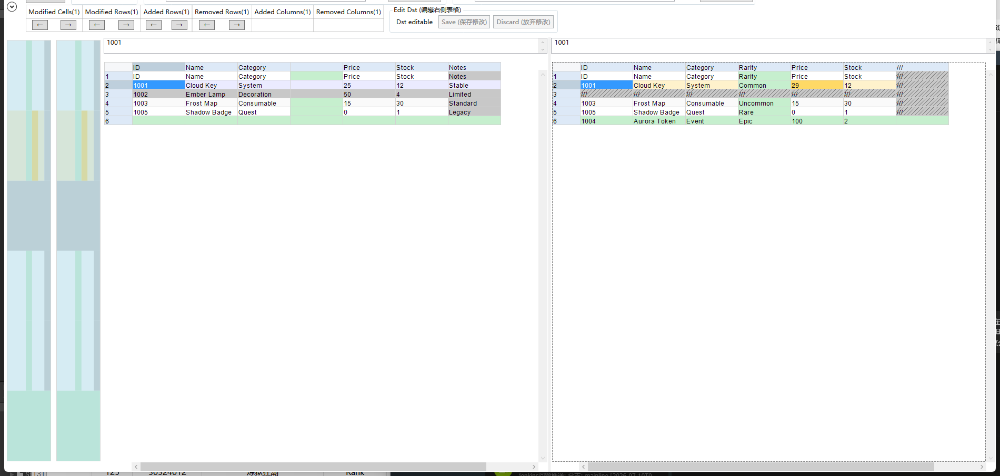
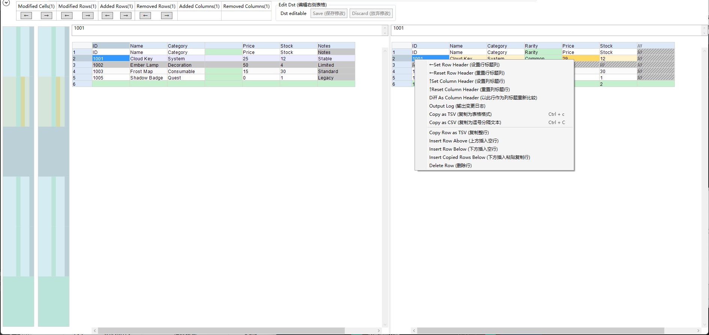

# SmartExcelMerge

SmartExcelMerge is a Windows spreadsheet diff tool based on [skanmera/ExcelMerge](https://github.com/skanmera/ExcelMerge). It keeps the lightweight Excel/CSV grid viewer and adds a table-aware diff model, code-diff-style insert/delete presentation, destination-side editing, and P4V integration.

## What Changed

### Smart Table Diff

- Aligns columns by unique headers, then uses anchored matching and bounded fallback matching for ambiguous headers.
- Aligns rows by a configured row key or an auto-detected ID/key/number-like column. Moving a keyed row does not become a delete plus add.
- Shows real insertions, removals, and modified cells instead of marking all trailing cells as modified after a row or column insertion.
- Reports added and removed column counts separately from modified rows and cells.
- Uses a bounded fallback path for large tables without reliable anchors, avoiding unbounded similarity work.

### Code-Diff-Style Presentation

| Visual | Meaning |
| --- | --- |
| Green | Added row or column content |
| Gray with `///` hatch | Removed row or column placeholder |
| Yellow | A cell value was modified |



The screenshot was produced from the public fixtures in [`docs/demo`](docs/demo): one added row, one removed row, one added column, one removed column, and one modified cell. The `ID=1005` record is also reordered to verify that a keyed row move is not treated as a remove/add pair.

### Edit the Destination Side

The right-hand sheet can be edited when launched with a writable destination:

- Edit or clear cells, paste rectangular TSV data, then save with `Ctrl+S` or `Save`.
- Copy selected cells as TSV/CSV.
- Copy a complete source row, insert blank rows above or below, insert the copied row below the selection, or delete selected destination rows.
- Save writes back to the original destination file after creating a local backup; discard restores the working copy.



## Build

Requirements:

- Windows
- Visual Studio 2022 or MSBuild with .NET Framework 4.8 targeting packs

```powershell
& "C:\Program Files\Microsoft Visual Studio\2022\Community\MSBuild\Current\Bin\MSBuild.exe" `
  "ExcelMerge.GUI\ExcelMerge.GUI.csproj" `
  /p:Configuration=Release /p:Platform=AnyCPU
```

The GUI output is written to `ExcelMerge.GUI\bin\Release\ExcelMerge.GUI.exe`.

## P4V Integration

The source for the P4V launcher is in [`tools/P4VWrapper`](tools/P4VWrapper). Build it with:

```powershell
& "C:\Program Files\Microsoft Visual Studio\2022\Community\MSBuild\Current\Bin\MSBuild.exe" `
  "tools\P4VWrapper\ExcelMergeP4VDiff.csproj" `
  /p:Configuration=Release
```

Place the built files in this layout:

```text
excel-smart-diff/
  app/ExcelMerge.GUI.exe
  p4v-diff/ExcelMergeP4VDiff.exe
```

In P4V, associate `xls`, `xlsx`, `xlsm`, `csv`, and `tsv` with `p4v-diff/ExcelMergeP4VDiff.exe` using these arguments:

```text
%1 %2 --open
```

The wrapper copies P4V's short-lived diff files to `%LOCALAPPDATA%\ExcelSmartDiff\p4v-diff\cache`, removes cache folders older than three days, and limits retained cache sessions. It launches editable diffs for `.xls` and `.xlsx` destination files.

## Test Fixtures

- [`smart-diff-before.xlsx`](docs/demo/smart-diff-before.xlsx)
- [`smart-diff-after.xlsx`](docs/demo/smart-diff-after.xlsx)

Run the GUI with these files to reproduce the screenshot and expected summary: `Modified Cells(1)`, `Modified Rows(1)`, `Added Rows(1)`, `Removed Rows(1)`, `Added Columns(1)`, and `Removed Columns(1)`.

## Upstream and License

This is a fork-derived project. It retains the original ExcelMerge copyright notice and is distributed under the [MIT License](LICENSE). It is not affiliated with the upstream author.
